### 扩散模型（DDIM）生成二次元头像（Anime Face）
##

也是一个老任务了，之前很久之前学习gan时候用到的数据集，没想在Kaggle上找到了。故尝试一下用扩散模型玩一下，数据集地址：https://www.kaggle.com/datasets/splcher/animefacedataset

***
### 生成效果：

数据集质量不是很好，感觉64X64的效果有点模糊......

| 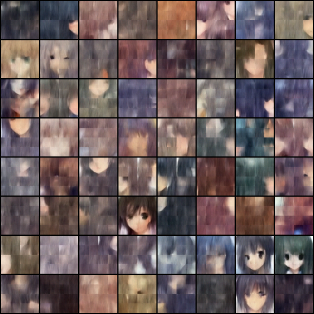 | 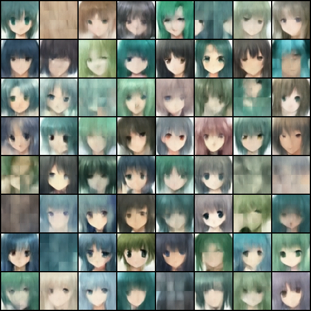 | 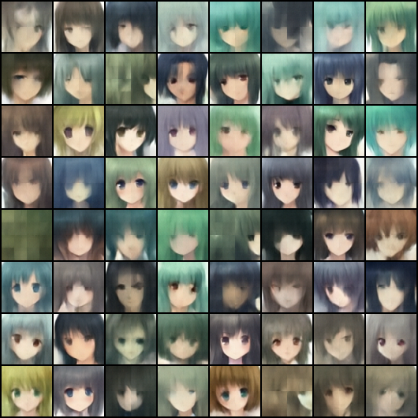 | 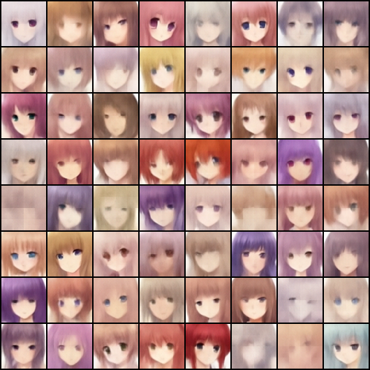 | 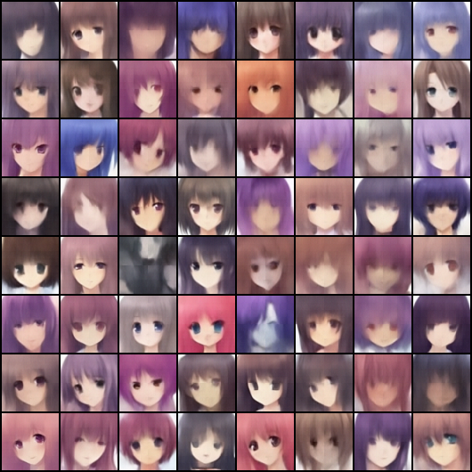 |
|:------------------:|:------------------:|:------------------:|:------------------:|:------------------:|
| 第 100 轮          | 第 200 轮          | 第 300 轮          | 第 400 轮          | 第 500 轮          |

| 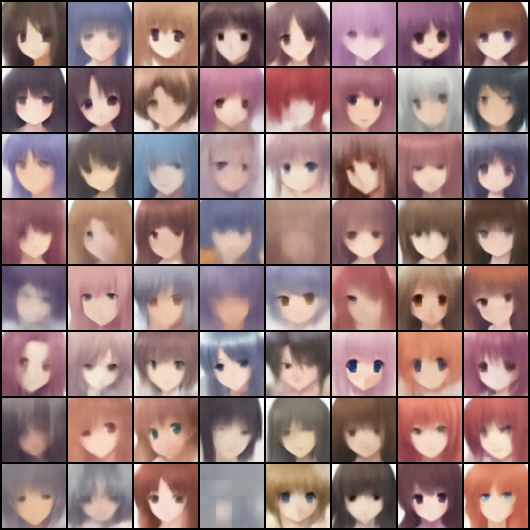 | 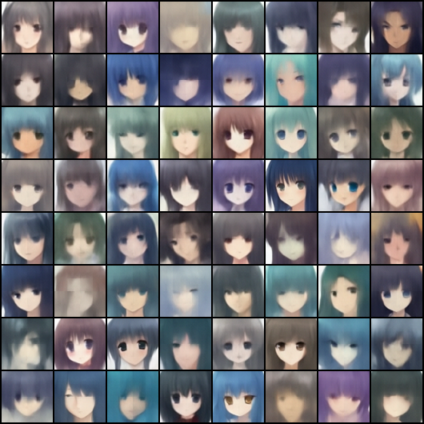 | 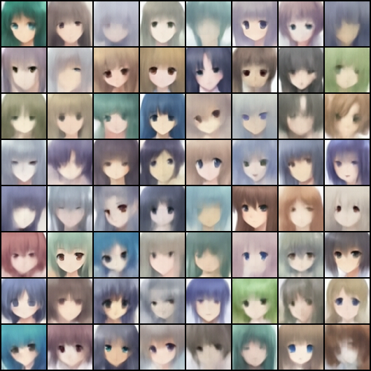 | 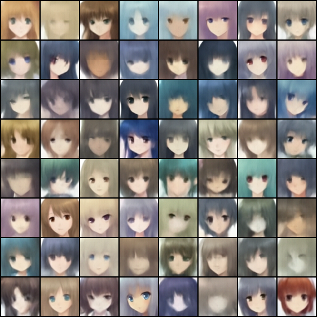 | 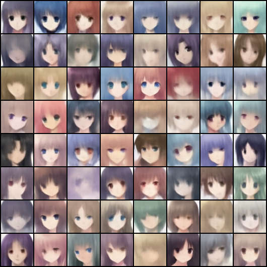 |
|:------------------:|:------------------:|:------------------:|:-------------------:|:-------------------:|
| 第 600 轮          | 第 700 轮          | 第 800 轮          | 第 900 轮           | 第 1000 轮          |

***
### 网络结构：

网络使用的是SwinUnet，可能会导致训练初期生成的图片上有“框框”，还伴随有部分patch错位，考虑是窗口注意力机制的问题，在训练后期则消失。

    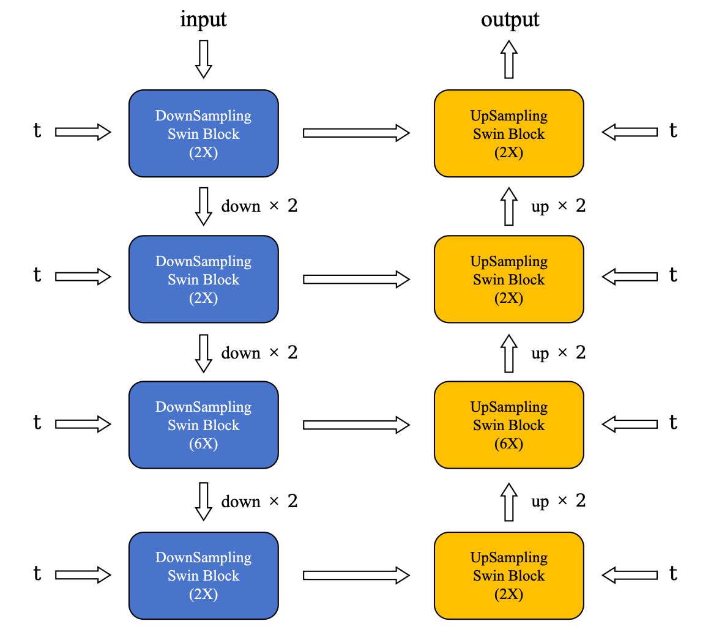

